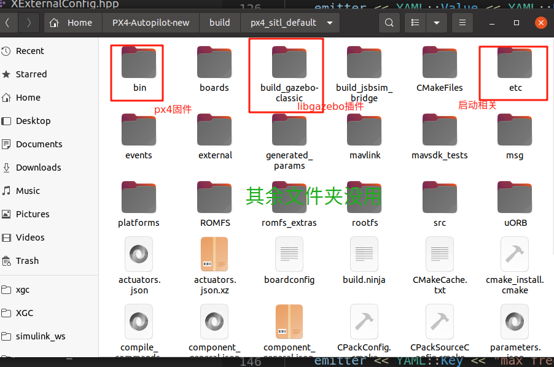

# px4_sitl

This is a ROS package containing the px4 SITL (Software In The Loop) targets and gazebo simulation plugins. All these targets and plugins are compiled from the [PX4 source code](https://github.com/PX4/PX4-Autopilot). The aim of this package is to simpilify the process of PX4 SITL simulation with gazebo as all the targets are prebuilt. **No need for downloading PX4 source code anymore!**

## Dependencies

Environment: Ubuntu20.04 wih ROS1 installed.

```bash
sudo apt install ros-noetic-mavros ros-noetic-mavros-extras -y
wget https://gitee.com/shu-peixuan/ros-install-command/raw/c9865c748045a0cce0173fcfcb95729784bd31e5/install_geographiclib_datasets.sh
sudo chmod a+x ./install_geographiclib_datasets.sh
sudo ./install_geographiclib_datasets.sh # this step takes some time
rm install_geographiclib_datasets.sh
```

```bash
sudo apt install --no-upgrade gazebo11 -y
sudo apt install --no-upgrade ros-noetic-gazebo-ros -y
sudo apt install xmlstarlet 
```

PX4 SITL build version:

v1.14.3 with the following modification (see also https://gitee.com/bhswift/fixed-wing-px4-modify.git):

1. Changed fixed-wing offboard mode in which PX4 can receives roll/height/airspeed setpoints.
2. Fix the gazebo_mavlink_interface.cpp plugin to allow multiple vehicle simulation acceleration (PX4_SIM_SPEED_FACTOR != 1).

## Build

```bash
mkdir -p px4_sitl_ws/src
cd px4_sitl_ws/src
git clone https://gitee.com/bhswift/px4_sitl.git
cd ../
catkin_make install
```

## Usage

Source the bash script in `install/` (**DO NOT `source devel/setup.bash`**).

```bash
source install/setup.bash
```

### Run the simulation for single vehicle 

You will launch `PX4 software simulation` + `gazebo gzserver` + `gazebo_ros vehicle spawn` + `mavros node`:

```bash
export PX4_SIM_SPEED_FACTOR=1
roslaunch px4_sitl single_mavros_px4_gazebo_sitl.launch vehicle:=iris gazebo_gui:=true
```

- `vehicle` options: `iris` (quadrotor), `plane`, `standard_vtol`

- `gazebo_gui` determines whether to open gazebo UI.
- `PX4_SIM_SPEED_FACTOR`: max simulation speed (less than 10 is appropriate).

### Run the simulation for multiple vehicles:

```bash
export PX4_SIM_SPEED_FACTOR=1
roslaunch px4_sitl multi_mavros_px4_gazebo_sitl.launch vehicle:=standard_vtol gazebo_gui:=true
```


## Develop

For a modified PX4 source code, compile the PX4 SITL in the source repo :

```bash
cd ~/PX4-Autopilot
make px4_sitl gazebo-classic
```

and substitute the `build/px4_sitl_default/bin` folder:

```bash
cp -r ~/PX4-Autopilot/build/px4_sitl_default/bin ~/px4_sitl_ws/src/px4_sitl/build/px4_sitl_default/bin
```

The modified gazebo plugins in `PX4-Autopilot/build/px4_sitl_default/build_gazebo-classic` should be moved to `build/px4_sitl_default/build_gazebo-classic` as well.

### Instructions:

The folder `build/` is copied from `PX4-Autopilot/build` with deletion of useless files:



- `bin/`: The PX4 software exectuables. (All copied)
- `build_gazebo-classic/`: The libgazebo plugins. (Some reserved)
- `etc/`: launch PX4 SITL related. (All copied)
- other files: useless and deleted.

The folders`models/` and `/worlds` are copied from `PX4-Autopilot/Tools/simulation/gazebo-classic/sitl_gazebo-classic`.

The file `launch/empty_world.launch` is copied from `gazebo_ros/launch`.
